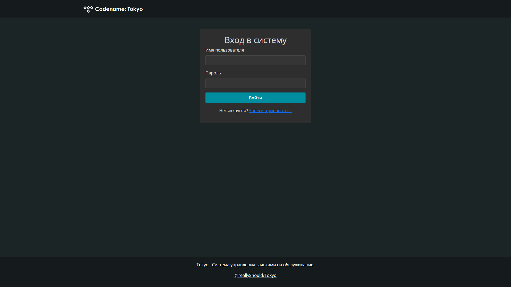
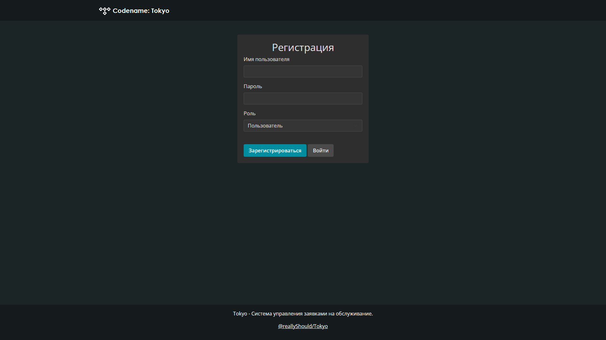
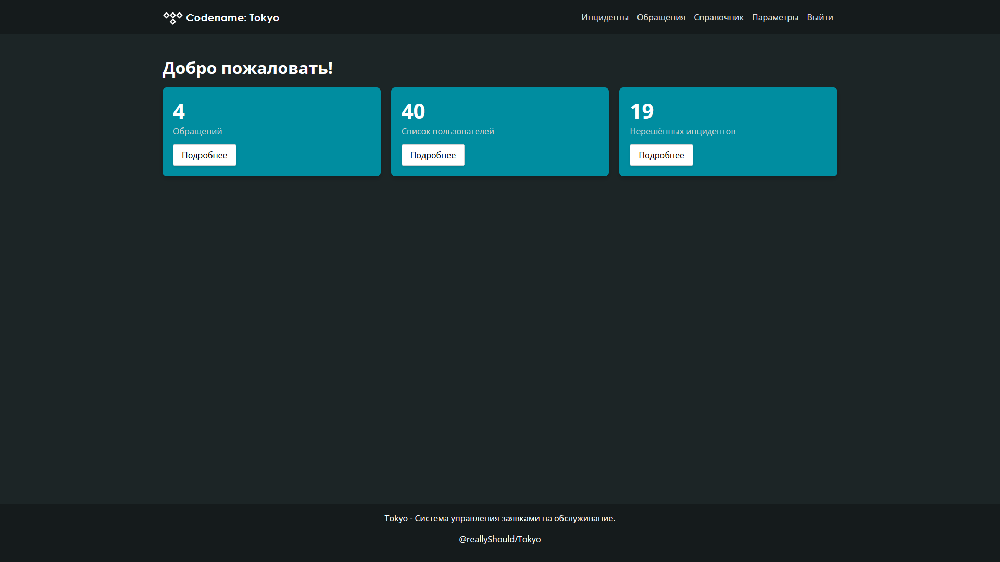
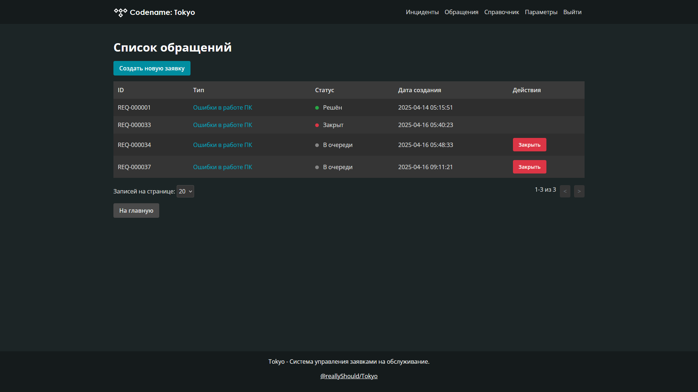
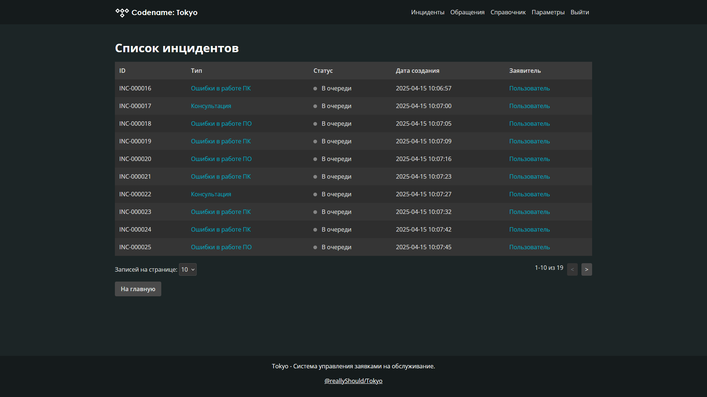
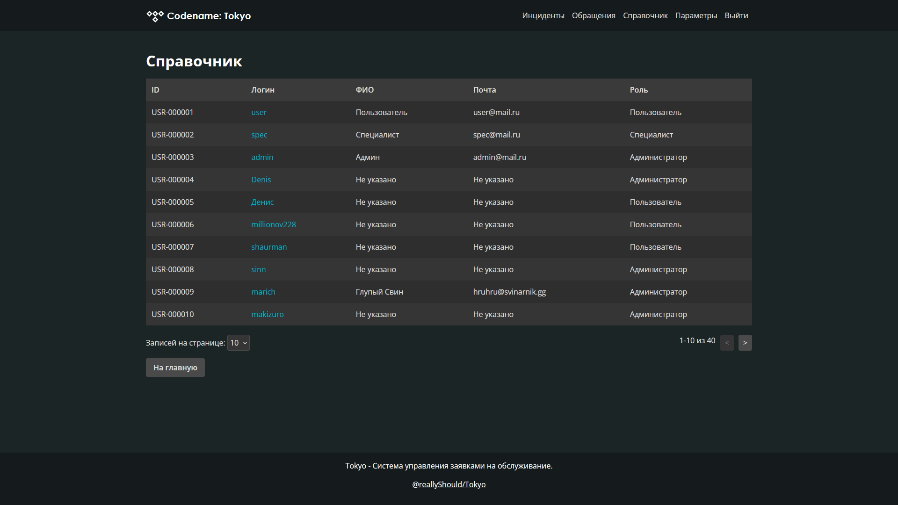

# Система управления инцидентами

Веб-приложение на базе Flask для управления заявками пользователей и инцидентами. Система предоставляет функционал аутентификации пользователей, управления заявками и инцидентами с учетом ролевого доступа (пользователи и специалисты).

## Описание

Это веб-приложение позволяет пользователям создавать и управлять своими заявками, а специалистам — обрабатывать и решать инциденты. Приложение построено с использованием Flask, SQLite в качестве базы данных и Flask-Login для управления сессиями пользователей.

## Возможности

- **Аутентификация пользователей:**
  - Регистрация с указанием имени пользователя, пароля и роли.
  - Вход и выход из системы.

- **Панель управления (Dashboard):**
  - Отображение статистики: количество открытых заявок, общее число пользователей и инцидентов (для специалистов).

- **Управление заявками:**
  - Создание новых заявок с заголовком и описанием.
  - Просмотр списка своих открытых заявок.
  - Закрытие собственных заявок.

- **Управление инцидентами (только для специалистов):**
  - Просмотр списка всех открытых инцидентов.
  - Просмотр деталей конкретного инцидента.
  - Решение инцидента с указанием описания решения.

- **Управление пользователями (только для специалистов):**
  - Просмотр списка всех пользователей.
  - Просмотр и обновление данных конкретного пользователя.

## Требования
Для работы приложения необходимы следующие зависимости (указаны в `req.txt`):
- Python 3.6+
- Flask
- Flask-SQLAlchemy
- Flask-Login
- bcrypt

## Установка

Чтобы установить и запустить проект, выполните следующие шаги:

1. **Клонируйте репозиторий:**
   ```bash
   git clone https://github.com/reallyShould/Tokyo.git
   ```
2. **Перейдите в директорию проекта:**
   ```bash
   cd Tokyo
   ```
3. **Создайте виртуальное окружение:**
   ```bash
   python3 -m venv venv
   ```
   - Для Windows:

     ```bash
     venv\Scripts\activate
     ```

   - Для Linux/macOS:

     ```bash
     source venv/bin/activate
     ```

4. **Установите зависимости:**

   ```bash
   pip install -r req.txt
   ```

5. **Запуск приложения:**

   ```bash
   python3 app.py
   ```
   Или используйте Makefile:
   ```bash
   make all
   ```

## Использование

После запуска приложения перейдите по адресу `http://localhost:3276`.
- **Регистрация:** Создайте новую учетную запись.
- **Вход:** Войдите, используя свои учетные данные.
- **Панель управления:** Просматривайте статистику и переходите к другим разделам.
- **Заявки:** Управляйте своими заявками.
- **Инциденты (только для специалистов):** Управляйте инцидентами.
- **Пользователи (изменение только для специалистов):** Управляйте данными пользователей.

### Роли пользователей

- **Пользователь (**`user`**):** Может создавать заявки, просматривать свои заявки и закрывать их.
- **Администратор (**`admin`**)** и **Специалист (**`system-adm`**):** Могут управлять инцидентами, просматривать и редактировать данные пользователей, а также видеть расширенную статистику.

## Конфигурация

Настройки приложения находятся в файле `config.py`. Основные параметры:
- `HOST`: Хост для запуска приложения (по умолчанию: "0.0.0.0").
- `PORT`: Порт для запуска приложения (по умолчанию: 3276).
- `SECRET_KEY`: Секретный ключ для сессий Flask (рекомендуется заменить на уникальный и безопасный ключ).
- `SQLALCHEMY_DATABASE_URI`: Путь к базе данных SQLite (по умолчанию: `instance/data.db`).
- `SQLALCHEMY_TRACK_MODIFICATIONS`: Отключение уведомлений об изменениях в базе (по умолчанию: `False`).

### Пример настройки

Для изменения порта или хоста отредактируйте `config.py`:
```python
class Config:
    HOST = "127.0.0.1"
    PORT = 5000
    SECRET_KEY = 'your_secret_key_here'
    SQLALCHEMY_DATABASE_URI = 'instance/data.db'
    SQLALCHEMY_TRACK_MODIFICATIONS = False
```

## Структура проекта

```
Tokyo
├── instance/
│   ├── data.db
│   └── empty
├── misc/
│   ├── dashboard.png
│   ├── incidents.png
│   ├── login.png
│   ├── register.png
│   ├── requests.png
│   └── users.png
├── routes/
│   ├── __init__.py
│   ├── auth_routes.py
│   ├── dashboard_routes.py
│   ├── incidents.py
│   ├── requests.py
│   └── users.py
├── static/
│   ├── fonts/
│   │   ├── a_centurygothic_bold.ttf
│   │   └── a_centurygothic.ttf
│   ├── img/
│   │   └── logo.svg
│   └── styles.css
├── templates/
│   ├── 403.html
│   ├── 404.html
│   ├── base.html
│   ├── create_request.html
│   ├── dashboard.html
│   ├── incident_detail.html
│   ├── login.html
│   ├── register.html
│   ├── requests.html
│   ├── resolve_incident.html
│   ├── settings.html
│   ├── user_detail.html
│   └── users.html
├── .gitignore
├── app.py
├── config.py
├── format_table.py
├── Makefile
├── models.py
├── README.md
└── req.txt
```

## Описание структуры

- `instance/`: Директория для хранения базы данных SQLite (`data.db`) и других временных файлов.
- `misc/`: Директория для хранения скриншотов и других вспомогательных файлов.
- `routes/`: Директория с маршрутами (blueprints) для Flask-приложения:
  - `auth_routes.py`: Маршруты для аутентификации (регистрация, вход, выход).
  - `dashboard_routes.py`: Маршруты для панели управления.
  - `incidents.py`: Маршруты для управления инцидентами (для специалистов).
  - `requests.py`: Маршруты для управления заявками.
  - `users.py`: Маршруты для управления пользователями (для специалистов).
- `static/`: Директория для статических файлов:
  - `fonts/`: Шрифты (`a_centurygothic_bold.ttf`, `a_centurygothic.ttf`).
  - `img/`: Изображения, такие как логотип (`logo.svg`).
  - `styles.css`: Основной файл стилей.
- `templates/`: Директория с HTML-шаблонами для рендеринга страниц:
  - `403.html`, `404.html`: Страницы ошибок.
  - `base.html`: Базовый шаблон для остальных страниц.
  - `create_request.html`: Страница создания заявки.
  - `dashboard.html`: Панель управления.
  - `incident_detail.html`: Детали инцидента.
  - `login.html`: Страница входа.
  - `register.html`: Страница регистрации.
  - `requests.html`: Список заявок.
  - `resolve_incident.html`: Страница разрешения инцидента.
  - `settings.html`: Страница настроек.
  - `user_detail.html`: Детали пользователя.
  - `users.html`: Список пользователей.
- `.gitignore`: Файл для исключения ненужных файлов из Git (например, виртуального окружения, базы данных).
- `app.py`: Главный файл приложения Flask, инициализирует приложение и регистрирует маршруты.
- `config.py`: Файл конфигурации с настройками (хост, порт, путь к базе данных и т.д.).
- `format_table.py`: Утилита для форматирования данных (например, перевод статусов и ролей на русский язык).
- `Makefile`: Файл для автоматизации задач:
  - `make all`: Запуск приложения.
  - `make clean`: Удаление базы данных и запуск приложения.
- `models.py`: Модели данных (классы `User` и `Users`) для работы с пользователями, заявками и базой данных.
- `README.md`: Документация проекта.
- `req.txt`: Файл с зависимостями (аналог `requirements.txt`).

## Схема базы данных

Приложение использует SQLite с двумя основными таблицами:
- **users (пользователи):**
  - `id`: Integer, первичный ключ, автоинкремент.
  - `username`: Text, уникальный, не null.
  - `fullname`: Text, может быть null.
  - `mail`: Text, может быть null.
  - `spec`: Text, может быть null.
  - `password_hash`: Blob, не null.
  - `role`: Text, не null, по умолчанию `'user'`.
- **requests (заявки):**
  - `id`: Integer, первичный ключ, автоинкремент.
  - `user_id`: Integer, внешний ключ, ссылается на `users.id`.
  - `title`: Text, не null.
  - `description`: Text, может быть null.
  - `status`: Text, по умолчанию `'open'`.
  - `resolution`: Text, может быть null.
  - `created_at`: Timestamp, по умолчанию текущая дата и время.

## Скрипты и утилиты

- **Форматирование данных (**`format_table.py`**):**

  - `change_names()`: Переводит статусы заявок на русский язык (например, "open" → "В очереди").
  - `change_spec()`: Переводит роли пользователей на русский язык (например, "admin" → "Администратор").
  - `check_none()`: Заменяет `None` в полях `fullname` и `mail` на "Не указано".

- **Makefile команды:**

  - `make all`: Запускает приложение.
  - `make clean`: Удаляет базу данных и перезапускает приложение.

## Скрины интерфейса







## Для тех кто долистал

- Любое имя коммита не имеет никакого смысла, тем более связанного с проектом. 
- Проект предназначен только для понимания разработки Web-проектов и сдачи диплома. 
- Текущий readme может случайно не обновиться вместе с проектом. 
- Имя проекта временное и может поменяться
- А еще ты прав, я действительно плюнул тебе в кофе ^_^